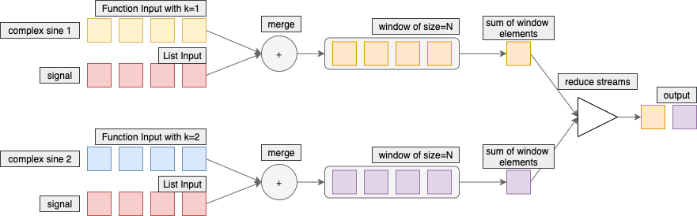
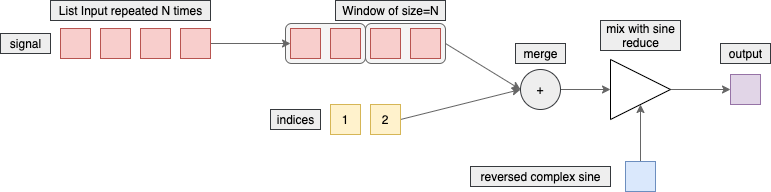

Week 2. Discreate Fourier Transform
============

<!-- START doctoc generated TOC please keep comment here to allow auto update -->
<!-- DON'T EDIT THIS SECTION, INSTEAD RE-RUN doctoc TO UPDATE -->
**Table of Contents**

- [Overview](#overview)
- [Generate a sinusoid](#generate-a-sinusoid)
- [Generate a complex sinusoid](#generate-a-complex-sinusoid)
- [Discreate Fourier Transform calculation](#discreate-fourier-transform-calculation)
- [Inverse Discreate Fourier Transform calculation](#inverse-discreate-fourier-transform-calculation)
- [Magnitude](#magnitude)
- [Conclusion](#conclusion)

<!-- END doctoc generated TOC please keep comment here to allow auto update -->

Overview
-----

The second week of the course is about the base understanding of Discrete Fourier Transform. DFT is the first thing for a audio signal processing. That functionality is builtin into WaveBeans framework using [FFT](https://wavebeans.io/docs/api/operations/fft-operation.html), though it's useful to know how you may approach similar things which may not be implemented inside the framework.

Generate a sinusoid
-----

WaveBeans has built-in [sine generator](https://wavebeans.io/docs/api/inputs/sines.html), however the idea here would be to build your own. Let's generate a sine of frequency f=10Hz, phase phi=1.0, amplitude a=1.0 and store 100ms of it into CSV file. With sample rate of 50Hz it'll create exactly 5 samples.

```kotlin
input { (idx, sampleRate) ->                  // 1
        val f = 10.0f                         // 2
        val a = 1.0                           // 3
        val phi = 1.0                         // 4
        val x = idx / sampleRate              // 5
        a * cos(x * 2.0 * PI * f + phi)       // 6
}
        .trim(100)                            // 7
        .toCsv("file:///path/to.csv")         // 8
```

Explanaton:
* Line #1. We're going to use function as input functionality that allows as to create an input from any mathematical function. More to read in the [documentation](https://wavebeans.io/docs/api/inputs/function-as-input.html).
* Lines #2-4. Define the input parameters of the sinusoid: frequency, amplitude and phase respectively.
* Line #5. Calculate the time of the sample. The `idx` operand of the function contains the number of the sample being calculated, divided by sample rate of the stream we're calculating the time marker of the sample.
* Line #6. According to the formula we're converting time into radians adding phase which is also in radians, getting the cosine value of it and multiply by the desired amplitude mapping `[-1, 1]` interval, that is produced by cosine function, into interval `[-a, a]`.
* Line #7. Limit the output with the desired length using [trim operation](https://wavebeans.io/docs/api/operations/trim-operation.html). To get 5 samples with the sample rate of 50Hz, you need to set the limiter to 100ms.
* Line #8. Store values into [CSV file](https://wavebeans.io/docs/api/outputs/csv-outputs.html).

The output would look like this:

```csv
time ms,value
0,0.5403023059
20,-0.6333238470
40,-0.9317180031
60,0.0574904034
80,0.9672490295
```

Generate a complex sinusoid
------

To generate a complex sinusoid we would need to start using [custom types](https://wavebeans.io/docs/api/readme.html#user-defined-type). Luckily the complex number is defined inside WaveBeans, and we may reuse it.

As this is mainly internal API it is not covered with documentation separately, however it is a part of [FFT Sample reference](https://wavebeans.io/docs/api/readme.html#fftsample).

Complex sine is defined as function of 2 parameters `k` and `n`. The `k` parameter defines the index of the sinusoid out of `n` sinusoids.
It uses [function definition as a class](https://wavebeans.io/docs/api/functions.html#function-as-class) to encapsulate that logic:

```kotlin
class GenerateComplexSineFn(params: FnInitParameters)                   // 1
: Fn<Pair<Long, Float>, ComplexNumber?>(params) {                       // 2

    constructor(k: Int, n: Int) : this(                                 // 3
            FnInitParameters().add("n", n).add("k", k)                  // 4
        )

    override fun apply(argument: Pair<Long, Float>): ComplexNumber? {   // 5
        val n = initParams.int("n")                                     // 6
        val k = initParams.int("k").toDouble()                          // 7
        val i = argument.first                                          // 8
        val x = (i % n) * 2.0 * PI * k / n                              // 9
        return cos(x) - sin(x).i                                        // 10
    }
}
```

Explanation:
* Line #1. Define the function name and provide default constuctor required by such functions.
* Line #2. All functions should extend the `Fn<T, R>` class. The type parameter `T` is the input of the function and as it is going to be used as input it is a `Pair<Long, Float>`, which is index of the sample and sample rate respectively. The output type parameter `R` in our case is complex number type `ComplexNumber`, though it is defined as nullable, but we don't use it here, there sinusoid values are cycled.
* Line #3. Convenience constructor which allows to encapsulate parameter propagation and leave the class API nice and readable.
* Line #4. As the secondary constructor defined it calls the primary constructor specifying the parameters in a way it can be used by a function executor. More about it [here](https://wavebeans.io/docs/api/functions.html#fninitparameters). Both parameters `n` and `k` are stored under respective keys.
* Line #5. The `Fn<T, R>` has only one function to implement which performs all work.
* Line #6-7.  Extracting `n` and `k` out of parameters and making them available via regular variables.
* Line #8. For convenience, extract the first value of argument and store it under more convenient name. It is the index of the sample.
* Line #9-10. Calculate the complex sine. The `i` values is cycled to be not more than `n`.

When the complex sine function is defined, we can use it as an input and store it to CSV, however as the type we're using has no built-in CSV support, we need to define [the function that explains how to store it](https://wavebeans.io/docs/api/outputs/csv-outputs.html#user-defined-csv-output).

```kotlin
val k = 1                                                        // 1
val n = 5                                                        // 2
    
SampleCountMeasurement.registerType(ComplexNumber::class) { 1 }  // 3

input(GenerateComplexSineFn(k, n))                               // 4
.rangeProjection(0, 5000)                                        // 5
.toCsv(                                                          // 6
        uri = "file:///path/to.csv",                             // 7
        header = listOf("index", "value"),                       // 8
        elementSerializer = { (idx, _, value) ->                 // 9
                listOf(idx.toString(), value.toString())         // 10
        }
)
```

Explanation:
* Line #1-2. Define the values of `n` and `k` which are going to be used during the execution.
* Line #3. Register the `ComplexNumber` we can do measures in time while limiting the stream. One number has the length of 1. More details [here](https://wavebeans.io/docs/api/operations/projection-operation.html#working-with-different-types).
* Line #4. Define the input as function using the class instance we've defined earlier.
* Line #5. Limit the stream so it'll end at some point. If we execute the stream with sample rate 1Hz, to generate 5 samples we would need to generate 5 seconds of data.
* Line #6. Start definition of the CSV output [with custom serialization](https://wavebeans.io/docs/api/outputs/csv-outputs.html#user-defined-csv-output).
* Line #7. The URI of the file to store the value to.
* Line #8. The list of headers of the resulted CSV, better to correspond to the number of columns. In our case it is an index of the sample and its value.
* Line #9-10. Define the element serializer. The element serializer converts the element to a list of strings `List<String>`, each element is a separate column in the CSV file. The [function](https://wavebeans.io/docs/api/functions.html) has 3 parameters: the index of the sample, sample rate the stream is being evaluated with, and the value of the sample itself. In our case we just call `toString()` methods on index and value. Th comlex number string is something like `1.0+2.0i`.

The output would look like this:

```csv
index,value
0,1.0+0.0i
1,0.30901699437494745-0.9510565162951535i
2,-0.8090169943749473-0.5877852522924732i
3,-0.8090169943749475+0.587785252292473i
4,0.30901699437494723+0.9510565162951536i
```

Discreate Fourier Transform calculation
--------

To calculate the DFT we need separately merge N sinusoids with the input signal. Despite the fact this is not the best approach to do this, let's try to do that straight away. The idea is to create N different inputs, merge them separately with the signal and then reduce down to one output. That is not the best idea because some work happens during configuration step while the stream is built but not when it's being executed. It is fine for certain use cases, but may kill any intent of using WaveBeans as a framework for distributed computations. See the picture below to get a better understanding of the idea.



```kotlin
val x = listOf(1, 2, 3, 4)                                    // 1
val n = 4                                                     // 2

SampleCountMeasurement.registerType(List::class) { it.size }  // 3

val signal = x.input()                                        // 4
(0 until n).map { k ->                                        // 5
        input(GenerateComplexSineFn(k, n))                    // 6
                .merge(signal) { (sine, x) ->                 // 7
                        requireNotNull(sine)                  // 8
                        requireNotNull(x)                     // 9
                        x * sine                              // 10
                }
                .window(n) { 0.r }                            // 11
                .map {                                        // 12
                        listOf(it.elements.reduce { a, b ->   // 13
                                a + b                         // 14
                        })                                    
                }
}
        .reduce { acc, s ->                                   // 15
                acc.merge(s) { (a, b) ->                      // 16
                        requireNotNull(a)                     // 17
                        requireNotNull(b)                     // 18
                        a + b                                 // 19
                }
        }
        .rangeProjection(0, x.size * 1000L)                   // 20
        .toCsv(                                               // 21
                uri = "file:///path/to.csv",                  // 22
                header = listOf("idx", "DFT value"),          // 23
                elementSerializer = { (idx, _, value) ->      // 24
                   listOf(idx.toString(), value.toString())   // 25
                }
        )
```

Explanation:
* Line #1-2. Define the input signal as a list of numbers. Define the `n`. Input signal in that implementation can be any but its length should be divisible by `n`.
* Line #3. The stream should be limited. At the time we cut it off, it'll have type `BeanStream<List<ComplexNumber>>`, and we need to measure somehow such stream. In this case we'll define the length as the list length. More details [here](https://wavebeans.io/docs/api/operations/projection-operation.html#working-with-different-types).
* Line #4. Convert our [list into the input](https://wavebeans.io/docs/api/inputs/list-as-input.html).
* Line #5. Let's create `n` inputs via cycling through the range.
* Line #6. As an input it is going to a complex sine defined above as function of `k` and `n`.
* Line #7-10. Merge the generated complex sine with the `signal`. The merge operation is simple multiplication of Double number (`x`) and Complex Number (`sine`), it is defined by WaveBeans framework. Both operands are required to be not null, we assume the streams are aligned with the lengths. That helps to avoid handling different situations if streams are different lengths, which would only complicate things now.
* Line #11. Windowing streams into groups of `n` samples. Though need to define the zero element function, which is just complex number `0+0i` in our case. More about [windows](https://wavebeans.io/docs/api/readme.html#window-of-any-type-t).
* Line #12-14. Each window created on previous step, needs to be converted into a sum of its elements. By calling Kotlin function `reduce()` we can do it nicely by collapsing a list of complex numbers into one complex number which is a sum of all. We wrap the single value as list, so later on they could be concatenated together into one big list.
* Line #15-19. When all `n` inputs are created, they need to be summed up into one output. All inputs is just a list of streams of the type `List<BeanStream<List<ComplexNumber>>>`, for simplicity you may think it as `List<BeanStream<T>>`. We need to sum them up. For that purpose we'll use Kotlin `reduce()` function once again. As reduce operation we'll call `merge()` where our small lists will be concatenated together forming a bigger list. In other words, what it is simply does is, if let's say you have inputs `a`, `b` and `c`, the reduce function is just `a + b + c`, but it works for N different inputs.
* Line #20. Previous operation made a single stream out of N similar streams. Need to get it ready for the output. With sample rate 1Hz and length of the input list N, we need exactly N sec to pass through the execution.
* Line #21-25. As in previous program, we define the CSV output [with custom serialization](https://wavebeans.io/docs/api/outputs/csv-outputs.html#user-defined-csv-output).

Current implementation limitations:
* The signal length must be divisible by `n`. It technically can be any, but that requires some improvement when the signal is being merged with the sinusoid.
* For big `n` the stream might be cumbersome, though it may not be a big problem.
* Generally the order of evaluation of inputs is not guaranteed, hence the elements in the resulting list may be swapped. The input should be numbered and the resulting list during reduce step should sort items taking that into account. But that would increase the complexity of the demonstration. It's going to work pretty fine on local executor.

The output of that stream is like this: 

```csv
idx,DFT value
0,[10.0+0.0i, -2.0000000000000004+1.9999999999999996i, -2.0-9.797174393178826E-16i, -1.9999999999999982-2.000000000000001i]
```

Inverse Discreate Fourier Transform calculation
-----------

To calculate IDFT we'll use slightly different approach. The stream should be processed N times, so instead of generating a few inputs, we'll make the stream N times longer. Then group it into windows of length N, and merge with the separate stream of indices, so we would know what element of reversed complex sine we need to mix with. And when we know all that information, we calculate the IDFT and provide the element into output. That makes any N elements on the input produce one element in the output. Follow the idea on the picture below.



First of all we need to define the function that calculates the value of reversed complex sine at specific point based on current `k` and `n`. It is as simple as that:

```kotlin
fun genReversedComplexSineAt(k: Int, n: Int, at: Int): ComplexNumber {
    val x = at * 2.0 * PI * k / n
    return cos(x) + sin(x).i
}
```

Then we can define the rest of the calculation:

```kotlin
val x = listOf(1, 1, 1, 1)                                               // 1
val n = x.size                                                           // 2
val xx = (0 until n).map { x }.flatten()                                 // 3
val indices = (0 until n).toList()                                       // 4

xx.input()                                                               // 5
        .window(n) { 0 }                                                 // 6
        .merge(indices.input()) { (x, i) ->                              // 7
                requireNotNull(x)                                        // 8
                requireNotNull(i)                                        // 9
                val n = x.elements.size                                  // 10
                x.elements.indices.map { k ->                            // 11
                        x.elements[k] * genReversedComplexSineAt(k, n, i)// 12
                }.reduce { acc, a -> acc + a } / n                       // 13
        }
        .toCsv(                                                          // 14
                uri = "file:///path/to.csv",                             // 15
                header = listOf("idx", "DFT value"),                     // 16
                elementSerializer = { (idx, _, value) ->                 // 17
                        listOf(idx.toString(), value.toString())         // 18
                }
        )
```

Explanation:
* Line #1-2. Define the input signal `x` and its length `n`.
* Line #3. Repeat the signal `x` N times and store it one after another. This is done by calling the `map()` to list which creates list of lists, then it flattens into one long list. I.e. if `x = (a,b)`, then repeated list 2 times going to be `((a,b), (a,b))`, and when you flatten it - `(a, b, a, b)`.
* Line #4. Generate the list of indices, the list containing the values between `0` and `n` exclusively.
* Line #5-6. Start the [input based on the list](https://wavebeans.io/docs/api/inputs/list-as-input.html) and group samples into groups of `n` samples, so effectively window contains the full signal.
* Line #7. Start the indices stream and merge with windowed initial signal, so each window gets its corresponding index. In this case we're [merging streams of different types](https://wavebeans.io/docs/api/operations/merge-operation.html#using-with-two-different-input-types).
* Line #8-9. Assuming our stream are aligned by length and we don't need to handle signal of different length, so none of operands are absent.
* Line #10-13. Calculating the element based on formula `sum(X[k] * sineK[i]) / n`.
* Line #14-18. As in previous program, we define the CSV output [with custom serialization](https://wavebeans.io/docs/api/outputs/csv-outputs.html#user-defined-csv-output).

The output looks like this:

```csv
idx,DFT value
0,1.0+0.0i
1,-4.592425496802574E-17+5.551115123125783E-17i
2,0.0+6.123233995736765E-17i
3,8.226161367281941E-17+8.326672684688674E-17i
```

As you can see the vector is transposed in that output comparing to previous output of DFT.

Magnitude
--------

Here we extend the DFT calculation to calcualate the magnitude spectrum of an input signal. To do that let's assume the DFT developed earlier is wrapped as function like this:

```kotlin
fun dft(n: Int, x: List<Number>): BeanStream<List<ComplexNumber>> {
    val signal = x.input()
    return (0 until n).map { k ->
        input(GenerateComplexSineFn(k, n))
                .merge(signal) { (sine, x) ->
                    requireNotNull(sine)
                    requireNotNull(x)
                    x * sine
                }
                .window(n) { 0.r }
                .map { listOf(it.elements.reduce { a, b -> a + b }) }
    }
            .reduce { acc, s ->
                acc.merge(s) { (a, b) ->
                    requireNotNull(a)
                    requireNotNull(b)
                    a + b
                }
            }
}
```

It is just a copy of previous implementation so it won't be explained here.

To calculate the magnitude spectrum we just need to add an additional operator call, we'll do that via [map operation](https://wavebeans.io/docs/api/operations/map-operation.html). The idea is for every complex number calcualte its absolute value. `ComplexNumber` type in WaveBeans has built-in function `abs()` that's doing that.

```kotlin
val x = listOf(1, 2, 3, 4)                                         // 1
val n = 4                                                          // 2

SampleCountMeasurement.registerType(List::class) { it.size }       // 3
dft(n, x)                                                          // 4
        .rangeProjection(0, x.size * 1000L)                        // 5
        .map { it.map(ComplexNumber::abs) }                        // 6
        .toCsv(                                                    // 7
                uri = "file:///path/to.csv",                       // 8
                header = listOf("idx", "Magnitude values"),        // 9
                elementSerializer = { (idx, _, value) ->           // 10
                        listOf(idx.toString(), value.toString())   // 11
                }
        )
```

Explanation:
* Line #1-2. Define the input signal `x` and its length `n`.
* Line #3-5. Call DFT calculation as explained in the approproate section above. Limit the output so with sample rate 1Hz the stream will evaluate exactly the length of the stream.
* Line #6. For each element in the stream, and the element has type `List<ComplexNumber>`, though for each item in that list as well, we call `abs()` function that returns the absolute value of complex number. The resulting type of the stream is `BeanStream<List<Double>>`.
* As in previous program, we define the CSV output [with custom serialization](https://wavebeans.io/docs/api/outputs/csv-outputs.html#user-defined-csv-output).

The output would look like this:

```csv
idx,Magnitude values
0,[10.0, 2.8284271247461903, 2.0, 2.8284271247461894]
```

Conclusion
---------

During that week we've learnt:
* How to calculate DFT using WaveBeans framework.
* Though it's not that valueable as WaveBeans has implementation of [FFT operation](https://wavebeans.io/docs/api/operations/fft-operation.html), the essential is the way how different formulas can be mapped to a stream calculation.
* How to work with custom types, and which types are implemented within WaveBeans framework.
* How regular Kotlin Collections API can be mixed with WaveBeans stream API to achieve better results.