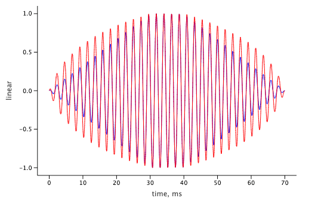

# WaveBeans: Fade In and Fade Out effects

## What is that

Very often while getting samples ready for the mix you need gracefully cut them in and cut them out. That allows you to reduce the amount of artifacts coming up while you are merging two samples one by one.

The artifacts such as clicks happen when different waveforms, while connecting, are not doing that correctly, create a big difference between neighbor points. To solve that problem you create samples that overlap with each other, though there is another problem coming up: some of the waves in both samples has close picks and when you sum them up the amplitude is way beyond the max, which for digital processing at the end of the day means it’ll be flatten and you’ll hear the distort effect, which may not be what you desire.

As a solution you can gradually change the amplitude from 100% to 0% for the waveform that ends and from 0% to 100% for the waveform that starts, while they overlap.

Of course, there are a lot of other use cases for fade effect. Such as when applying inverse STFT to generate the signal back, the overlapped parts are needs to be merged together correctly. Fade effect also helps here.

During the course of this article, I’ll provide the idea on how to implement the effect and apply it within the WaveBeans framework.

## A little math and high level algorithm

The math behind the effect is very simple. Assuming we have a signal `Y` which we want to change.

If we want to change the amplitude (meaning values of signal `Y`) we need to multiply each value of signal `Y` to some factor, or another function that provides such factors if it requires to change within the time which is our case.

Effectively we’re doing a cross product of two vectors Y and X, where X is the result of our fade function. We'll multiply corresponding values and generate the result vector.

As other the input parameters: we need to have a kick in point K where effect will get started, and the time of going from 0% to 100% which we’ll call duration -- D. For the sake of this algorithm let’s assume they are measured in amount of samples.

1. Let’s define the fade function X = f(K, D, x), where x is the integer sample number [0,..):
2. The function should start changing the on a kick in point K, before that the signal should be 0, and should be at maximum when it is out of the interval D: if (x < K) 0 else if (x > K + D) 1 else /*do the calculation.*/
The function kicks in on point K and calculates the values based on where we are in interval D: (x - K) / D
The calculation above returns values way beyond desired interval [0, 1], as an extension we need to make sure fit if it is less than 0, then return just 0, if it is more than 1, use 1. Applying that trick won't require the check of where we are.

## Fade functions implementation

We’ll implement the fade functions as [WaveBeans function as an input](https://wavebeans.io/docs/api/inputs/function-as-input.html) so any signal may use it by simply mixing it in. The function will use parameters in seconds, which we would need to convert before using to samples. The fade in function sample code is below.

```kotlin
val fadeInMix = input { (sampleIndex, sampleRate) ->
    // parameter `kick in time` in seconds
    val kickInTime = 0.0
    // parameter `duration` in seconds
    val duration = 0.05
    // calculate the kick in time in samples based on current sample rate
    val fadeInMinAt = sampleRate * kickInTime
    // calculate duration in samples based on current sample rate
    val durationInSample = sampleRate * duration
    // calculate the position in interval making sure it is inside the interval [0.0, 1.0]
    min(
        max(
            (sampleIndex - fadeInMinAt) / durationInSample,  
            0.0
        ),
        1.0
    )
}
```

If we plot that function we'll see how it changes through the time:


Similar way we can implement the fade out function. The only difference the duration should be inverted so it changes from 1.0 to 0.0.

```kotlin
val fadeOutMix = input { (sampleIndex, sampleRate) ->
    // parameter `kick in time` in seconds
    val kickInTime = 0.02
    // parameter `duration` in seconds
    val duration = 0.05
    // calculate the kick in time in samples based on current sample rate
    val fadeOutMaxAt = sampleRate * kickInTime
    // calculate duration in samples based on current sample rate
    val durationInSample = sampleRate * duration
    // calculate the position in interval making sure it is inside the interval [0.0, 1.0]
    min(
        max(
            1.0 - (sampleIndex - fadeOutMaxAt) / durationInSample,
            0.0
        ),
        1.0
    )
}
```

The plot looks like this:


## Mix it in

The fade functions are ready, let's apply them on the top of some signal. For the sake of demonstration sine of 440Hz will work fine, but any waveform might be used -- generated or loaded from the file.

Here is how our input signal looks like

```kotlin
val s = 440.sine()
```

If we plot the first 70ms of it, it'll look like this, the amplitude constantly is at 1.0:


Now let's apply the fade in function, the input parameters are hardcoded in implementation: kick in time is 0ms, duration is 50 ms.

```kotlin
var r1 = s * fadeInMix
```

And if we plot the first 70 ms we'll see how its amplitude is being changed from minimum to maximum


Similar way apply the fade out function, the input parameters are hardcoded in implementation: kick in time is 20ms, duration is 50 ms.

```kotlin
var r2 = s * fadeOutMix
```

The plotting will result in the graph that shows how amplitude is being changed from maximum to a minimum.


Let's apply both functions at the same time to get the fade in and then out effect, to achieve that we'll just multiply it one-by-one

```kotlin
var r3 = s * fadeInMix * fadeOutMix
```

After plotting we'll see that both functions were applied, but as they overlap in time the signal never reaches its maximum at 1.0.


## Different fade in-out functions

Above we've tried to apply the linear function, another functions may produce better results for some cases. Let's try logarithmic function as an example. For logarithmic function you would need to define base (any double more than 1.0 exclusive), the base defines how steep the value will change in the first "half". We'll try this out with the base value 10.0. Find the sample code below.

The way it works: the interval [0.0, 1.0] is mapped to [1.0, < base >], so the logarithm function when applied would return values in [0.0, 1.0] interval.

```kotlin
val fadeInLogMix = input { (sampleIndex, sampleRate) ->
    // parameter `kick in time` in seconds
    val kickInTime = 0.0
    // parameter `duration` in seconds
    val duration = 0.05
    // parameter `base` of the logarithmic function
    val base = 10.0
    // calculate the kick in time in samples based on current sample rate
    val fadeInMinAt = sampleRate * kickInTime
    // calculate duration in samples based on current sample rate
    val durationInSamples = sampleRate * duration
    // calculate the argument of the algorithmic function, it should be >= 0.0
    val x = max(sampleIndex - fadeInMinAt, 0.0) / durationInSamples
    // calculate the position in interval using logarithm function
    // and make sure it is inside the interval [0.0, 1.0]
    min(
      log(x * (base - 1.0) + 1.0, base),
      1.0
    )
}
```

This is how it looks plotted


When applied on top of the signal:


Similar way we can define the fade out function, though you need invert not the result but the argument of the logarithmic function.

``` kotlin
val fadeOutLogMix = input { (sampleIndex, sampleRate) ->
    // parameter `kick in time` in seconds
    val kickInTime = 0.02
    // parameter `duration` in seconds
    val duration = 0.05
    // parameter `base` of the logarithmic function
    val base = 10.0
    // calculate the kick in time in samples based on current sample rate
    val fadeOutMaxAt = sampleRate * kickInTime
    // calculate duration in samples based on current sample rate
    val durationInSamples = sampleRate * duration
    // calculate the argument of the algorithmic function, it should be >= 0.0
    val x = max(sampleIndex - fadeOutMaxAt, 0.0) / durationInSamples
    // calculate the position in interval using logarithm function
    // and make sure it is inside the interval [0.0, 1.0]
    max(
        min(
          log((1.0 - x) * (base - 1.0) + 1.0, base),
          1.0
        ),
        0.0
    )
}

```

Plotting the function:


And plotting the signal:


### Difference

If we plot two functions on the same canvas, we'll be able to compare how different they are. To make sure the signal will reach the maximum, the duration and kick in time was tuned a little bit.



How that difference affects your signal depends on your use case, but to my ear the logarithmic functions makes smoother transitions.

## Further improvements

The functions specified here are handy to play with, but it is not very convenient to use them in production code. For example if the function is [defined as a class](https://wavebeans.io/docs/api/functions.html#function-as-class), you may be able to parameterize it in the moment of execution.

Or even further, use Kotlin extension function to create a fluent API like:

```kotlin
signal.fadeIn(.5).fadeOut(.5)
```

As you noticed, these functions has only 1 parameter -- duration, kick in time should be calculated but generally it is possible only for finite stream, so the functions can be defined this way for `FiniteStream<Sample>`. Finite stream from infinite may be created by calling [`trim()` operation](https://wavebeans.io/docs/api/operations/trim-operation.html). So the implementation may look like this:

```kotlin
fun FiniteStream<Sample>.fadeIn(duration: Double): FiniteStream<Sample> {
    return (Fade.inMix(0.0, duration) * this)
        .trim(this.length(TimeUnit.NANOSECONDS), TimeUnit.NANOSECONDS)
}

fun FiniteStream<Sample>.fadeOut(duration: Double): FiniteStream<Sample> {
    val k = this.length(TimeUnit.MILLISECONDS) / 1000.0 - duration
    return (Fade.outMix(k, duration) * this)
        .trim(this.length(TimeUnit.NANOSECONDS), TimeUnit.NANOSECONDS)
}
```

This implementation uses the `Fade` object, but it is just wraps the implementation of the functions above as a class. Implementation is left as an exercise for the reader.

## Resources

1. To play around with functionality you may use [WaveBeans extension of Jupyter with Kotlin](https://github.com/WaveBeans/jupyter-wave), which source code is available on GitHub.
2. The notebook used for these article can be found in the [blog repository](https://github.com/WaveBeans/wave-blog/blob/fade-in-out/fade-in-out-effect/fade-in-out-nb.ipynb)
