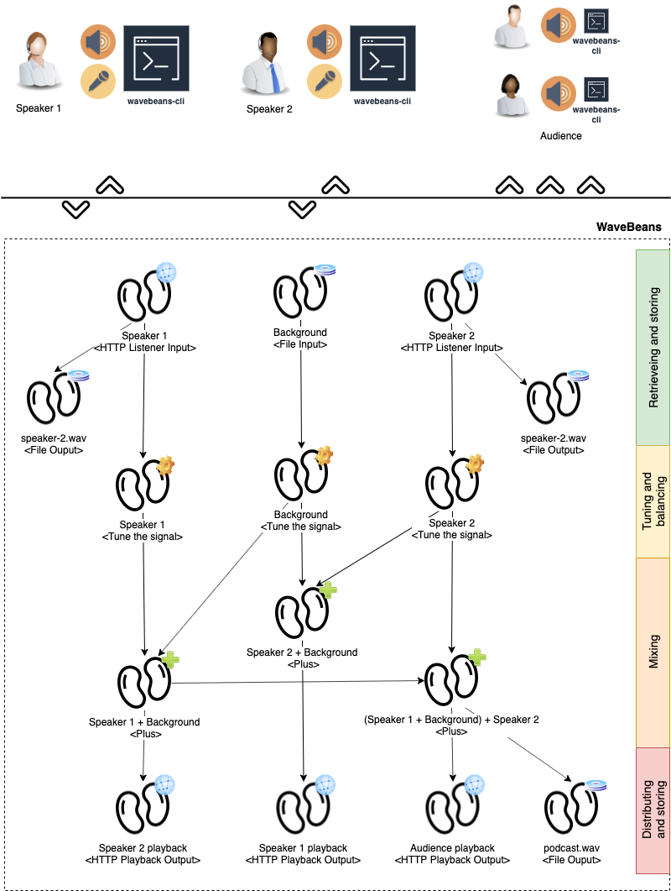

# Creating Podcast engine with WaveBeans

Let's try to build a platform that allows you to make podcasts with other people over the internet. Imagine you and your friend are talking about different things over the phone and want other guys listen to that, and also share the recording afterwards

Of course you may use other communication applications out there, record it and share afterwards, or use specifically built for that purpose platforms. But it might be not flexible enough, and there is definitely not a lot of fun in it if you can write some code.

## Requirements

We'll go through building a system with two speakers, however it might be easily extended to any number.

* The **Speaker** (1st and 2nd) should be able to record his voice from his/her PC and transfer it to the server.
* Also **Speaker** needs to hear the interlocutor(s) in order to follow the dialogue.
* **Speaker**'s speech is stored separately to the file, to mix it differently later on.
* **Audience** should be able to connect and listen to whatever Speakers are talking about without interfering with their talk.
* Some **Background** should be playing on the background. For now let's just limit with looped track, but that can be easily supplemented with a different input stream which is controlled remotely.
* The live **Mix** should be written to the file.

## Prerequisites

1. You should have WaveBeans available and ready to use.
2. You should be able to make your WaveBeans installation available to access over HTTP(S) on several ports to your Speakers and Audience.
3. Speakers and Audience should be able to run simple commands in the terminal and have WaveBeans CLI installed.

## The plan

Let's come up with the plan and then walkthrough it in more details. See the Figure 1.


Figure 1. Podcast engine beans schema.

## Set up out clients

Speaker needs to run `wavebeans-cli` tool and make it transfer output of the his/her microphone to the server:

```bash
$> ./bin/wavebeans-cli
[TODO] provide commands here to start capturing audio
```

Also Speaker needs to run another instance of `wavebeans-cli` tool to get the signal back.

```bash
$> ./bin/wavebeans-cli
[TODO] provide commands here to start playback
```

Audience should do pretty much the same to start listening.

```bash
$> ./bin/wavebeans-cli
[TODO] provide commands here to start playback
```

## WaveBeans skeleton

```kotlin
// open the HTTP listener input on port 9000 and 9001 in order to capture the voice from the speaker.
val speaker1 = http(port = 9000)
val speaker2 = http(port = 9001)
// open some background music
val background = wave("file:///background.wav", Loop())

// define the output for speakers to store initial signals
outputs += speaker1.toWave("file:///speaker-1.wav")
outputs += speaker2.toWave("file:///speaker-2.wav")

// let's do some volume balancing, it is basically changing the amplitude. Here you can have more sophisticated handling, i.e normalization and so on.
speaker1 *= 1.2
speaker2 *= 1.1
background *= 0.7

// let's prepare some outputs so speakers may here themselves
val speaker1Mix = speaker2 + background
val speaker2Mix = speaker1 + background

// speakers would need to connect to 9100 and 9101 ports respectiely in order to hear everything else
outputs += speaker1Mix.toHttp(port = 9100)
outputs += speaker2Mix.toHttp(port = 9101)

// prepare a mix for audience
val mix = speaker1Mix + speaker2

// make mix available for distribution on port 9102 and write it to the file
outputs += mix.toWave("file:///mix.wav")
outputs += mix.toHttp(port = 9102)
```
