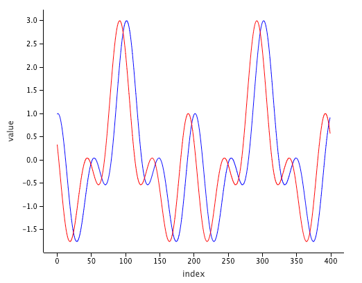
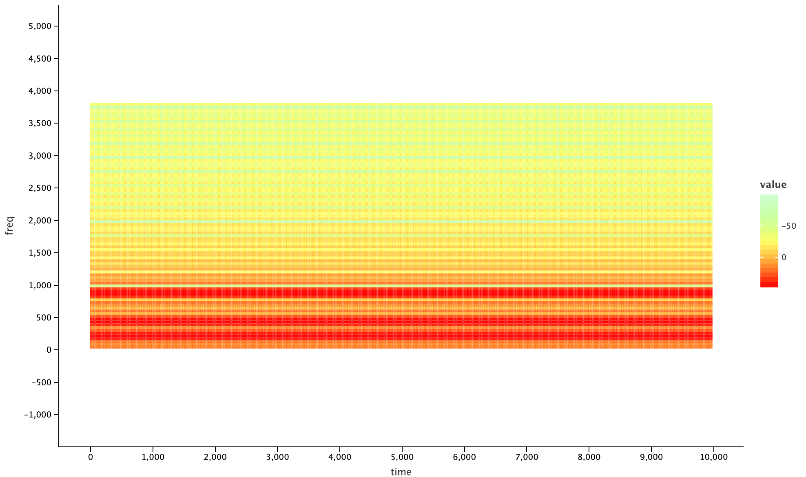
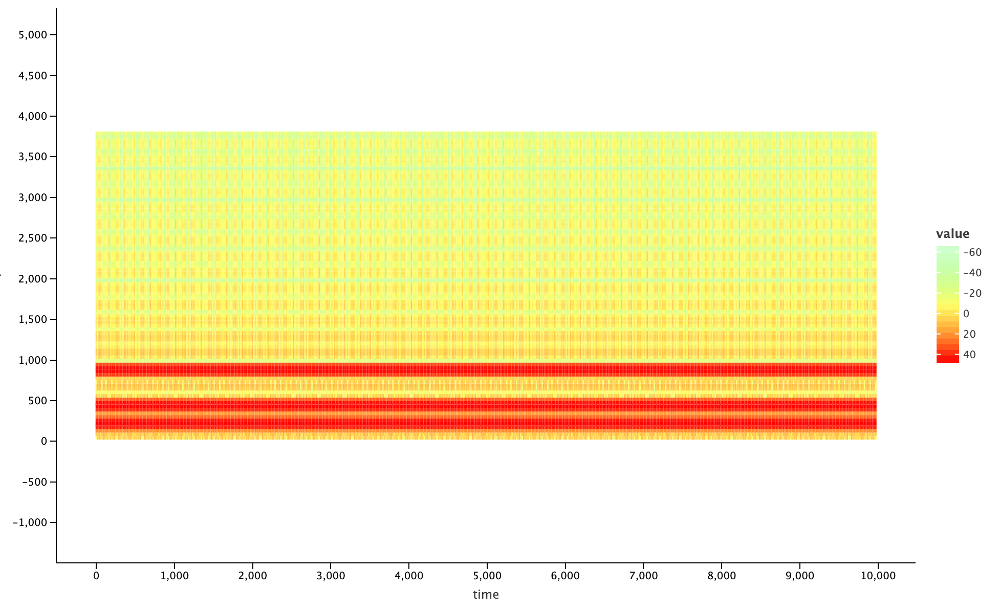

# Audio processing with Jupyter on Kotlin.

<!-- START doctoc generated TOC please keep comment here to allow auto update -->
<!-- DON'T EDIT THIS SECTION, INSTEAD RE-RUN doctoc TO UPDATE -->
**Table of Contents**

- [What's this all about?](#whats-this-all-about)
- [Projects statuses](#projects-statuses)
- [Prerequisites](#prerequisites)
- [Initial steps](#initial-steps)
- [Preparing the notebook](#preparing-the-notebook)
- [Short signal: generate and visualize](#short-signal-generate-and-visualize)
- [Long signal](#long-signal)
  - [Generate and share](#generate-and-share)
  - [Query and visualize](#query-and-visualize)
- [Resources](#resources)
- [Contacts](#contacts)

<!-- END doctoc generated TOC please keep comment here to allow auto update -->


## What's this all about?

As you may already know, Kotlin may be used for solving [various data science tasks](https://kotlinlang.org/docs/reference/data-science-overview.html). The most essential tools interconnecting various tasks during research from performing calculations to visualization of results nowadays are so called Notebooks. [Jupyter](https://jupyter.org/) is one of the most popular and well-known. In this article we'll cover how to use [WaveBeans](https://wavebeans.io/) framework to solve different type of problems related to Audio Signal Processing.

Depending on the use case, you would need to use different execution mechanisms provided by WaveBeans: either execution [using Kotlin sequence](https://wavebeans.io/docs/exe/#using-sequence) or [multi-threaded mode](https://wavebeans.io/docs/exe/#multi-threaded-mode). Let's get started.

## Projects statuses

At the time of writing of this article most of mentioned and crucial projects are in alpha state. You should be very careful if you consider using them in production critical systems. Though all projects are worth to look at.

## Prerequisites

To follow the steps described here, you need to have quite a little:

* [Docker](https://www.docker.com/) installed, as we're trying to avoid installing various software on the working station If you don't have it installed please follow the official documentation, it is fairly simple for the most part.
* Or you might be able to use standalone Jupyter installation, you would need to have python and JDK 8 installed. Though it won't be covered here in details.

## Initial steps

First of all, we need to install the Jupyter with Kotlin kernel. 

Once you installed the Docker, the next thing we would need to do is to create a Jupyter with [Kotlin-kernel](https://github.com/Kotlin/kotlin-jupyter) image we will use to run. Create a `Dockerfile` in your working directory with the following content:

```dockerfile
FROM jupyter/base-notebook

USER root

# Install OpenJDK-8
RUN apt-get update && \
    apt-get install -y openjdk-8-jdk && \
    apt-get install -y ant && \
    apt-get clean;

# Fix certificate issues
RUN apt-get update && \
    apt-get install ca-certificates-java && \
    apt-get clean && \
    update-ca-certificates -f;

# Setup JAVA_HOME -- useful for docker commandline
ENV JAVA_HOME /usr/lib/jvm/java-8-openjdk-amd64/
RUN export JAVA_HOME

# Install kotlin kernel
RUN conda install -c jetbrains kotlin-jupyter-kernel
```

Explanation:
1. The `jupyter/base-notebook` image is the base image, this is the first line in any Docker file.
2. The base image is built with different user which doesn't have enough rights to perform further actions, so need to switch to using `root`.
3. The next group installs JDK 8 and fixes certificates issues as they are not installed automatically. And finally propagate the `JAVA_HOME` environment variable for various use cases.
4. The last action is to install the Kotlin kernel via `conda`.

To build image invoke the `docker build` command, and tag it (`-t`) with`kotlin-jupyter` so we can easily access it later:

```bash
docker build -t kotlin-jupyter .
```

It'll take time some, and once it finished we can `run` the image and access the Jupyter notebooks. The Jupyter UI can be access in the browser under address `http://localhost:8888`, though you'll be asked for a token which you would see in the console:

```bash
docker run -it -p 8888:8888 -p 6800:6800 -v "$(pwd)"/notebooks:/home/jovyan/work kotlin-jupyter
```

A few things require more explanation about `run` command:
1. `-it` flags (`i` and `t`) allows interaction with Jupyter process inside the docker, for example to stop execution of the notebook via `Ctrl-C` shortcut.
2. `-p` flags are exposing two ports so they could be accessed in the browser, the `8888` is the notebook port, `6800` is the one we're going to use later to share the data. Actually you don't need it if you don't query data outside of your notebooks, just keep that possibility in mind.
3. `-v` flag specifies the volume mount, so our notebooks will be stored in our local filesystem under `notebooks` folder, and they won't get lost accidentally.
4. And lastly, the image name `kotlin-jupyter`, which we've specified during the build.

## Preparing the notebook

A few words about kotlin-kernel and what we need to do in order to get notebook ready for our further endeavors.

* We'll be using [lets-plot](https://github.com/JetBrains/lets-plot) library for visualizations via its [Kotlin API](https://github.com/JetBrains/lets-plot-kotlin). Kotlin-kernel has built-in support for it, so just specify it with `%` sign and `use` keyword in any cell before you actually start calling the API:
    
    ```jupyter
    %use lets-plot
    ```

* In order to add WaveBeans as a dependency a few extra lines need to be added. We'll be using [version 0.0.3](https://wavebeans.io/wavebeans/release_notes.html#version-003-on-2020-04-03)
    
    * Add repository to locate the artifact: 
    
        ```kotlin
        @file:Repository("https://dl.bintray.com/wavebeans/wavebeans")
        ```

    * Add dependency artifact:

        ```kotlin
        @file:DependsOn("io.wavebeans:lib:0.0.3")
        ```

* Also it is useful to add all imports along with all dependencies, so all cells are clear of such non-relevant information. The exact list of imports we'll provide while dive deeper into specific cases, but generally you would have the following ones:
    
    ```kotlin
    import io.wavebeans.lib.*
    import io.wavebeans.lib.io.*
    import io.wavebeans.lib.math.*
    import io.wavebeans.lib.stream.*
    import io.wavebeans.lib.stream.fft.*
    import io.wavebeans.lib.stream.window.*
    import io.wavebeans.lib.table.*
    import java.util.concurrent.TimeUnit.*
    ```

Let's put it all into the first cell and execute it. Once it is done proceed no the next chapter.

## Short signal: generate and visualize

When the notebook is ready and has all API connected we can proceed forward. No extra dependencies or imports required.

Firstly, let's define a signal we want to visualize. In our case it is going to be 1 second of the sum of 3 sinusoids of frequencies of 220, 440 and 880 Hz.

```kotlin
val o = (880.sine() + 440.sine() + 220.sine())
    .trim(1000, MILLISECONDS)
```

As we have only one stream and more over it is finite and quite short there is no point executing it via overseers, we can just execute it as a [Kotlin sequence](https://wavebeans.io/docs/exe/#using-sequence). Let's execute it twice getting different parts of the same stream:

```kotlin
val values = o.asSequence(44100.0f)
    .drop(500)
    .take(400)
    .map { it.asDouble() }
    .toList()
    
val values2 = o.asSequence(44100.0f)
    .drop(510)
    .take(400)
    .map { it.asDouble() }
    .toList() 
```

Here we get 400 samples but in the first case we skip first 500 samples, in the second, 10 samples more.

Then we need to convert the data into a columnar Data Frame which understands the `lets_plot` library. The Kotlin type is `Map<String, List<Any>>`, where the key is column name, and the value is the list of of values to use.

```kotlin
val dataFrame = mapOf(
    "index" to (0 until values.size).toList(),
    "value" to values
)
val dataFrame2 = mapOf(
    "index" to (0 until values2.size).toList(),
    "value" to values2
)
```

For our case we create two columns:
* `index` keeps the indices of the value from 0 to the size of the corresponding list
* `value` keeps the values themselves.

As the final step we plot it: the first data frame is blue, the second one is red. The x-axis is mapped to be `index` column, the y-axis is `value` column

```kotlin
lets_plot() { x = "index"; y = "value" } + 
    geom_line(dataFrame, color = "blue") + 
    geom_line(dataFrame2, color = "red")
```

The result looks like this:



## Long signal

Let's assume your signal takes a lot of time to process or it is simply infinite. That actually shouldn't stop you from getting sense what's going on in there while it is being evaluated. For that purpose we'll split the process into two notebooks: one to generate and share the data, another to query and visualize it. 

The generator will store the data into [memory tables](https://wavebeans.io/docs/api/outputs/table-output.html) which then will be available for querying via [HTTP Table Service API](https://wavebeans.io/docs/http/#table-service). The query part with the help of HTTP client retrieves that data and visualizes while the first streams are still in the processing.

The exact example:
1. Generate the signal, i.e. sum of three sinusoids with frequencies of 220, 440 and 880 Hz.
2. Perform the Fast Fourier Transform (FFT) applying two different window functions:
    * Triangular
    * Hamming
3. Store both FFTs into tables so we could compare them visually.

While visualizing we would see how the output is different depending on the parameters we've used.

### Generate and share

The first part of this exercise is to start generation of signal and store it into memory tables. That requires a little more dependencies to add:

* Additionally to WaveBeans API library need to add Execution API and HTTP Service:

    ```kotlin
    @file:DependsOn("io.wavebeans:exe:0.0.3")
    @file:DependsOn("io.wavebeans:http:0.0.3")
    ```

* Logging support is not required but would be helpful for some cases, you may no add it in the beginning, just bare in mind:

    ```kotlin
    @file:DependsOn("ch.qos.logback:logback-classic:1.2.3")
    @file:DependsOn("ch.qos.logback:logback-core:1.2.3")
    ```

*Note: Do not forget to register the WaveBeans repository.*

Also the list of the imports is extended with HTTP and Execution imports, so add the following onto the list:

```kotlin
import io.wavebeans.http.*
import io.wavebeans.execution.*
```

As it is required for us to share the data outside of the notebook, let's start the server. The port it'll start on is `6800` -- remember the one that was additionally exposed when we've run the image via Docker? This is the one. You can change it, but don't forget to change it in both places.

```kotlin
HttpService(serverPort = 6800).start()
```

As the next step let's set up our streams. The initial signal is sum of sinusoids (220Hz, 440Hz and 880Hz), then it is windowed and the window function is applied. After that the FFT is performed and result is being stored into a memory table, so it is accessible for querying. The streams are infinite, but the table keeps only last 2 minutes of data retiring everything out of this range.

* Specify the parameters of future calculations:
    
    ```kotlin
    val windowSize = 801
    val stepSize = 256
    val fftSize = 1024
    ```

* Define a signal, windowed sum of sinusoids:
    
    ```kotlin
    val signal = (880.sine() + 440.sine() + 220.sine())
                .window(windowSize, stepSize)
    ```

* The first FFT applying the triangular window function:

    ```kotlin
    val triangularFft = signal
        .triangular()
        .fft(fftSize)
        .toTable("fft-triangular", 2.m)
    ```

* And the seconds FFT applying the hamming window function:

    ```kotlin
    val hammingFft = signal
        .hamming()
        .fft(fftSize)
        .toTable("fft-hamming", 2.m)
    ```

All outputs are defined. To execute them all in parallel need to use [local distributed overseer](https://wavebeans.io/docs/exe/#multi-threaded-mode), only it evaluates all streams in parallel:

```kotlin
val overseer = LocalDistributedOverseer(
    listOf(triangularFft, hammingFft), 
    threadsCount = 2,
    partitionsCount = 2
)
```

And to start the evaluation, regular code to wait for success or handle errors, though in our case that code won't run to the end if everything is running with no errors:

```kotlin
val errors = overseer.eval(44100.0f)
    .map { it.get().exception }
    .filterNotNull()
    .toList()
    
overseer.close()

if (errors.isEmpty()) {
    println("SUCCESS")
} else {
    println("ERROR:\n" + errors.joinToString("\n"))
}
```

We can execute the notebook and switch to another browser tab to create a new notebook to visualize the streams.

### Query and visualize

To visualize the data we will first request it over HTTP, deserialize it and remap it the way the plotting library requires.

* First of all dependencies. From built-in dependencies we need to add `lets-plot` library for charts and `klaxon` for JSON serialization.
* For querying data we'll use java builtin client: `java.net.*`
* Also need to add some of the missed imports for `lets-plot`: `jetbrains.letsPlot.scale.*`

Overall the initialization cell would look like this:

```kotlin
%use klaxon
%use lets-plot

import java.net.*
import jetbrains.letsPlot.scale.*
```

The next step would be to create a function that queries data over HTTP Table API. The data is provided in JSON format and needs to be mapped to an object. The table we're querying provide access to FFT Sample. Referring to the [documentation](https://wavebeans.io/docs/http/#fftsample-schema) on how that object is serialized, let's create a class to describe how tow parse the JSON objects:

```kotlin
data class FftSample(
    val index: Long, 
    val binCount: Int, 
    val samplesCount: Int, 
    val sampleRate: Float, 
    val magnitude: List<Double>,
    val phase: List<Double>,
    val frequency: List<Double>,
    val time: Long
)
```

The data is being returned wrapped as a result container which we also need to define. It's much simpler, based on the [Table Service documentation](https://wavebeans.io/docs/http/#table-service) and keeping the `value` as class we've just defined:

```kotlin
data class Result(val offset: Long, val value: FftSample)
```

To query the data let's develop convenience function that'll do it for us. The function will query the data over HTTP from specific table, then remap the table to a columnar representation which is required for plotting. By the way we'll cut off the frequencies we don't need to see.

The parameters of this function are: 
* `table` -- the name of the table the data is being stored to (`fft-triangular` or `fft-hamming`)
* `freqCutOff` -- is pair of Integers that defines what range we want to keep (i.e. for range 100Hz-1000Hz  it would look like a Pair `100 to 1000`)

The algorithm of the function is as following:
1. Query the data getting last 10 seconds, the result we read line by line. Each line is transformed to a `Result` object with the help of Klaxon library.
2. Calculate the `timeShift` so all values would start with 0 on x-axis;
3. Map the data represented as `List<Result>` to list of tuples (`List<Array<Any>>`) which then we map to a data frame. By the way, we'll cut off the frequencies we're not interested in. 
4. Map the resulted list to a columnar data frame which has type `Map<String, List<Any>>`

A little more explanation on the remapping solution. Single FFT sample contains the time of the frame and amount of `FftSample.binCount` corresponding values of magnitude and frequency. For plotting the time needs to be duplicated for every magnitudes and frequencies pairs. For example, that structure:
```plain
400: [ 
       { 100.0, 0.2 },
       { 150.0, 0.4 },
       { 200.0, 0.2 }
     ],
500: [ 
       { 100.0, 0.3 },
       { 150.0, 0.1 },
       { 200.0, 0.1 }
     ]
```
must be remapped to such tuples
```plain
{ 400, 100.0, 0.2 },
{ 400, 150.0, 0.4 },
{ 400, 200.0, 0.2 },
{ 500, 100.0, 0.3 },
{ 500, 150.0, 0.1 },
{ 500, 200.0, 0.1 }
```
Then the final data map is formed of the lists made out of corresponding indexes of tuples.


The code of the function listed below:

```kotlin
fun fftData(table: String, freqCutOff: Pair<Int, Int>): Map<String, List<Any>> {
    val k = Klaxon()
    val server = "http://localhost:6800"

    // 1. read and deserializae the data
    val data = URL("$server/table/$table/last?interval=10s").openStream().reader().readLines()
    .map { k.parse<Result>(it)!! }
    
    // 2. Calculate the time value to shift values to 0 by x-axis
    val timeShift = data.asSequence().map { it.value.time }.min() ?: 0
    
    // 3. remap the FftSample to list of tuples
    val table = data.asSequence().map {v -> 
            // magnitudes and frequencies are making pairs like (10.0dB, 100hz), (20.0dB, 150Hz), etc.
            v.value.magnitude.asSequence()
                .zip(v.value.frequency.asSequence())
                // filtering out frequencies out of the provided range
                .filter { it.second >= freqCutOff.first && it.second <= freqCutOff.second}
                // map values to tuples
                .map { arrayOf(
                        (v.value.time - timeShift) / 1e+6, // to milliseconds
                        it.second, 
                        it.first
                )}
        }
        // convert list of lists to plain list
        .flatten()
        .toList() // this gives a list of tuples [ (time, freq, value), ... , (time, freq, value)]

    // 4. remap tuples to columnar structure by index
    val dataFrame = mapOf(
        "time" to table.map { it[0] },
        "freq" to table.map { it[1] },
        "value" to table.map { it[2] }
    )    

    return dataFrame    
}
```

The last thing is left to do, call the newly made function and plot the result:

```kotlin
val df1 = fftData("fft-triangular", freqCutOff = 10 to 3800)

lets_plot(df1) {x = "time"; y = "freq"; fill = "value"} + 
    ggsize(1000, 600) + 
    geom_tile() + 
    scale_fill_gradient(low = "light_green", high = "red")
```

Similar the another table `fft-hamming` is being queried and plotted. 

```kotlin
val df2 = fftData("fft-hamming", freqCutOff = 10 to 3800)
lets_plot(df2) {x = "time"; y = "freq"; fill = "value"} + 
    ggsize(1000, 600) + 
    geom_tile() + 
    scale_fill_gradient(low = "light_green", high = "red")
```

As a result you would see the spectrogram of the signals that is being process right now in the notebook running on a different tab. Also you would notice the difference between two window functions and how it affects the result.

**FFT Spectrogram with Triangular window function**

 

 **FFT Spectrogram with Hamming window function**

 

As you can see `hamming` window is more exact in detecting the frequencies in frequency domain, but probably in time domain or some other use case `triangular` would benefit of being not that exact.

## Conclusion

During the course of this article we've learnt:

* The basics of using Kotlin with Data Science tool Jupyter.
* How to use Jupyter Notebooks with WaveBeans in two different scenarios: short and long signal.
* How to evaluate WaveBeans streams using different mechanism: sequence and multi-threaded mode.
* How to use WaveBeans HTTP Table Service API to keep the data and then share it to use in external systems.
* How different the FFT when applied different window functions over the same signal.

## Resources

* [Repository with implemented Jupyter notebooks](TODO)
<!-- <!-- -->
* [WaveBeans documentation web-site](https://wavebeans.io)
* [Kotlin kernel for Jupyter GitHub project](https://github.com/Kotlin/kotlin-jupyter)
* [Kotlin lets-plot API GitHub project](https://github.com/JetBrains/lets-plot-kotlin)
* [Klaxon JSON parser GitHub project](https://github.com/cbeust/klaxon)
* [About Fast Fourier Transform (FFT) on Wiki](https://en.wikipedia.org/wiki/Fast_Fourier_transform)
* [About Window function on Wiki](https://en.wikipedia.org/wiki/Window_function)
<!-- -- > -->

<!-- <!-- -->
## Contacts

If you have any questions or ideas do not hesitate to reach out.

* [WaveBeans Github project](https://github.com/WaveBeans/wavebeans)
* [Telegram channel `wavebeans`](https://t.me/wavebeans)
* [Twitter @WaveBeans](https://twitter.com/wavebeans)
<!-- -- > -->